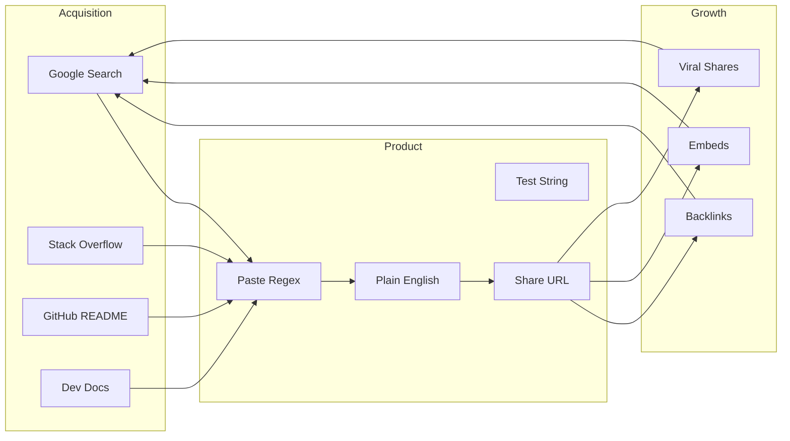
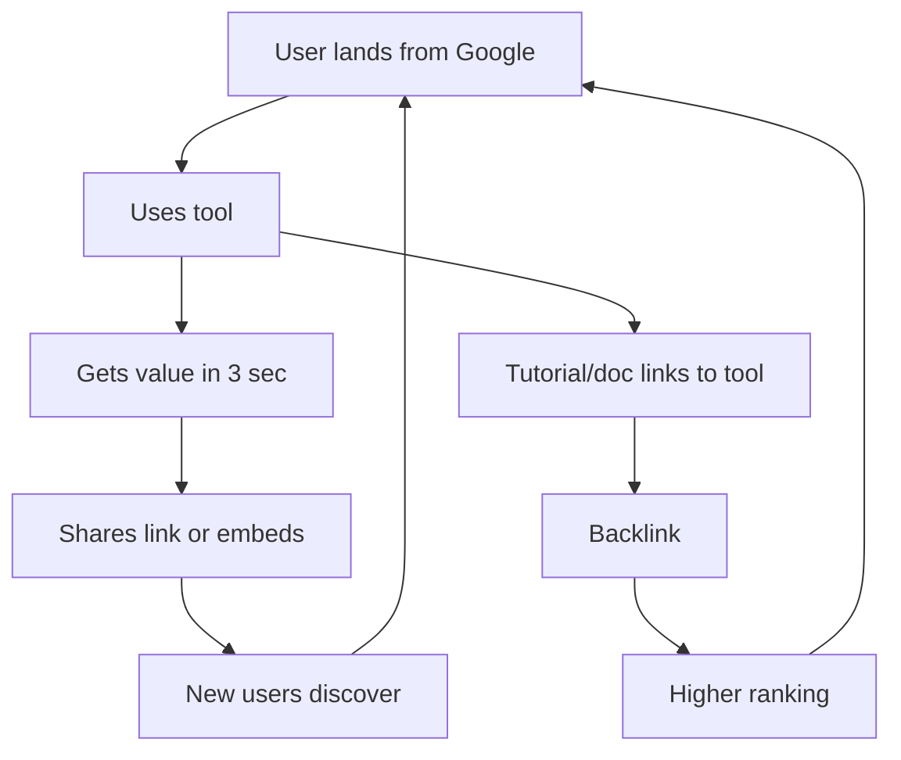

# Stateless SaaS Product Strategy: 1M+ Organic Traffic

## Ideation Summary: 20 Concepts Scored

| Concept                       | Traffic | Feasibility | Simplicity | Shareability | SEO | Total  |
| ----------------------------- | ------- | ----------- | ---------- | ------------ | --- | ------ |
| Regex Explainer + Playground  | 9       | 10          | 7          | 9            | 9   | **44** |
| HTTP Status Code Reference    | 9       | 10          | 9          | 8            | 10  | **46** |
| JWT Debugger                  | 9       | 9           | 8          | 9            | 9   | 44     |
| Cron Expression Explainer     | 8       | 10          | 8          | 8            | 9   | 43     |
| Unicode/HTML Entity Reference | 8       | 10          | 8          | 6            | 10  | 42     |
| Epoch Timestamp Converter     | 9       | 10          | 9          | 7            | 9   | 44     |
| Text Diff with Shareable URL  | 8       | 10          | 8          | 9            | 8   | 43     |
| MIME Type Reference           | 7       | 10          | 9          | 5            | 9   | 40     |
| Color Contrast Checker        | 7       | 10          | 8          | 6            | 8   | 39     |
| Hash Generator                | 8       | 10          | 9          | 7            | 8   | 42     |
| ... (10 more eliminated)      |         |             |            |              |     |        |

**Eliminated:** Calculators, simple converters, formatters, UUID generators, QR generators (saturated). JWT Debugger loses to jwt.io dominance. Epoch converter excluded per "avoid converters."

**Final selection:** **Regex Explainer + Playground** — highest combined score among non-saturated, high-leverage tools. regex101 proves 700K+ monthly traffic; a 10x simpler product can capture share and grow beyond that.

---

## 1. Final SaaS Concept

**Name: RegExplain** (or **RegexPlain**)

A dead-simple regex explainer and playground. Paste any regex → get plain-English explanation in under 3 seconds. Type a test string → see matches highlighted. Share via URL (state encoded in hash). No signup, no backend, no AI.

**Why this wins:** regex101 has 700K monthly visits but is overwhelming (flavor selector, library, complex UI). RegExplain does one thing: "What does this regex do?" — answered instantly. The "explain" use case is underserved; most tools focus on testing. Developers, students, and technical writers search "regex explain" and "what does this regex mean" constantly.

---

## 2. Problem It Solves

**Global problem:** Regex is universally painful. Every developer, DevOps engineer, data analyst, and technical writer encounters regex. Understanding an existing regex (from code, config, or docs) is harder than writing one. Current options:

- regex101: Powerful but complex; explanation is secondary
- regexr.com: Similar
- AI tools: Require API, login, or subscription; overkill for quick lookup

**Pain:** "I found this regex in the codebase. What does it do?" — no fast, free, no-login answer.

---

## 3. Why This Can Reach 1M+ Organic Traffic

**Traffic engines:**

1. **Search demand:** "regex explainer" (~~8K/mo), "regex tester" (~~22K/mo), "what does this regex do" (long-tail), "regex cheat sheet" (~6K/mo). regex101 alone gets ~700K/mo; a simpler alternative captures a share and grows via SEO.
2. **Educational backlinks:** Tutorials, bootcamps, and docs link to regex tools. Each link = compounding traffic.
3. **Shareable URLs:** State in hash (`#regex=...&test=...`) → users share in Slack, SO, GitHub. Recipients land on the tool with the regex pre-loaded.
4. **Embeddable:** Optional iframe embed for docs sites → "Try this regex" with live tool. Each embed = backlink + discovery.
5. **Long-tail SEO:** Pages for "regex for email", "regex for phone", "regex for URL" — each targets a use case. 20–50 pages = broad coverage.

**Path to 1M:** 500K from core tool (regex explainer + tester) + 300K from long-tail SEO pages + 200K from embeds and shares.

---

## 4. Search Demand

| Keyword                 | Est. Volume | Intent                 |
| ----------------------- | ----------- | ---------------------- |
| regex tester            | ~22,000     | High — direct tool use |
| regex explainer         | ~8,000      | High — core use case   |
| regex cheat sheet       | ~6,000      | Medium — reference     |
| regex online            | ~5,000      | High                   |
| what does this regex do | Long-tail   | High — underserved     |
| regex for email         | ~2,000      | Medium — use-case page |
| regex for phone number  | ~1,500      | Medium                 |
| javascript regex        | ~12,000     | High                   |
| python regex            | ~8,000      | High                   |

**Total addressable:** 100K+ monthly from primary keywords; long-tail adds 2–5x.

---

## 5. Core Features

1. **Paste regex** — Input box, instant parse
2. **Plain-English explanation** — Each token/group explained (e.g., `\d+` → "one or more digits")
3. **Test string** — Optional; highlights matches in real time
4. **Shareable URL** — State in hash; copy link, share
5. **Flavor selector** — JavaScript (default), Python, PCRE — affects explanation
6. **Error detection** — Invalid regex → clear error message
7. **No ads, no signup** — Zero friction

---

## 6. Stateless Architecture

- **100% client-side:** All logic runs in the browser
- **No backend:** No server, no database, no API calls
- **State in URL:** Regex + test string encoded in `window.location.hash` (base64 or compressed)
- **No user data:** Nothing stored, nothing collected
- **Instant load:** Single HTML + JS + CSS; no external dependencies beyond optional CDN for syntax highlighting

---

## 7. Technical Implementation

**HTML:** Single-page structure; input areas, output area, share button.

**CSS:** Minimal, responsive; dark/light mode via `prefers-color-scheme`.

**JavaScript:**

- **Regex parser:** Use a JS regex parser (e.g., `regexpp` or hand-rolled) to break regex into tokens
- **Token-to-English mapper:** Map each token type (`\d`, `+`, `*`, `[]`, `()`, etc.) to a human-readable string
- **Test matching:** Use `RegExp` and `String.prototype.matchAll` for highlighting
- **URL state:** `btoa`/`atob` or LZ-string for compression; read/write `location.hash`
- **Flavor:** Adjust explanation for Python vs JS (e.g., `\d` vs `[0-9]`)

**Optional WebAssembly:** Not required for MVP; JS is sufficient for parsing and explanation.

---

## 8. SEO Strategy

1. **Core page:** `/regex-explainer` — targets "regex explainer", "regex tester"
2. **Use-case pages:** `/regex/email`, `/regex/phone`, `/regex/url` — each with example + embedded tool
3. **Language pages:** `/regex/javascript`, `/regex/python` — flavor-specific
4. **Meta tags:** Unique title/description per page
5. **Schema:** `SoftwareApplication` for the tool
6. **Internal linking:** Use-case pages link to main tool; main tool links to use cases

---

## 9. Viral Mechanisms

1. **Shareable links:** "Here's what that regex does" → link with regex pre-loaded; recipient uses tool, may share again
2. **Stack Overflow:** Answers include "Try it: [link]" — high-intent traffic
3. **Slack/Discord:** Developers share in channels
4. **Embed:** Docs sites embed the tool; footer: "Powered by RegExplain" with link
5. **GitHub:** README badges or "Debug this regex" links in issues

---

## 10. Competitive Advantage

| Competitor         | Weakness                          | Our edge                   |
| ------------------ | --------------------------------- | -------------------------- |
| regex101           | Complex UI, explanation secondary | 10x simpler; explain-first |
| regexr.com         | Similar to regex101               | Focus on "explain" only    |
| AI tools           | Login, API, cost                  | No login, free, instant    |
| regex cheat sheets | Static, no testing                | Interactive + shareable    |

**Moat:** Speed (3 seconds to value), shareability (URL = state), and SEO (use-case pages). No one owns "regex explainer" as a clear category.

---

## 11. MVP Plan

**Phase 1 (2–3 weeks):**

- Single page: paste regex → plain-English explanation
- JavaScript flavor only
- Basic error handling
- Shareable URL (regex in hash)
- Deploy to averonsoft.com/regex-explainer

**Phase 2 (1–2 weeks):**

- Test string input + match highlighting
- Python flavor option
- 5 use-case pages (email, phone, url, etc.)

**Phase 3 (ongoing):**

- Embeddable widget
- More use-case pages
- Optional: PCRE, more flavors

---

## 12. Growth Flywheel

1. **Search → Use:** User finds "regex explainer", uses tool
2. **Use → Share:** User shares link with regex; colleague uses it
3. **Share → Backlink:** Tutorial author embeds or links; we get backlink
4. **Backlink → Rank:** More backlinks → better ranking → more search traffic
5. **Repeat:** Each cycle strengthens the flywheel

**Timeline to 1M:** 12–24 months with consistent SEO and shareability. regex101 reached 700K; a simpler, explain-focused product can capture and exceed that with the right distribution.